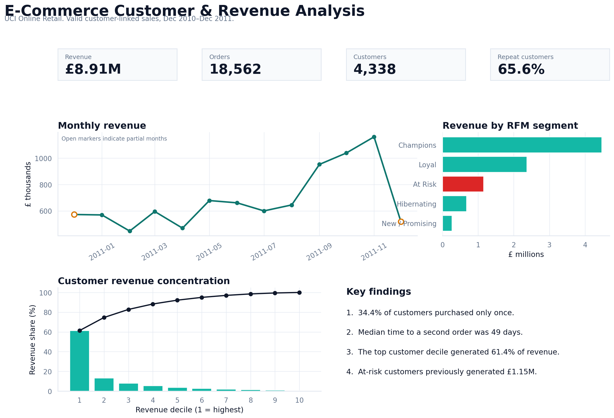
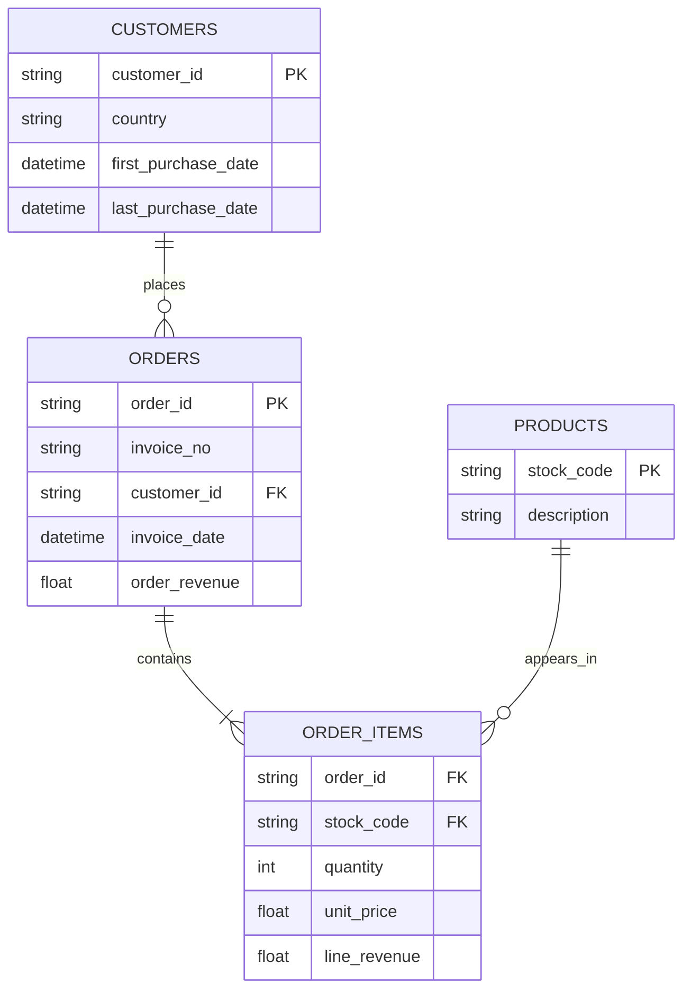

# E-Commerce Customer & Revenue Analysis

**SQL + Python | Customer retention, revenue concentration, RFM segmentation, and cohort analysis**



## Business question

How can an online retailer grow revenue by improving repeat purchasing and focusing effort on the customers, markets, and products with the strongest commercial value?

I analyzed 541,909 transaction lines from a UK-based online retailer. I used Python and Pandas to clean and model the source data, SQLite to answer business questions, and Matplotlib/Seaborn to communicate the results.

## Executive summary

The cleaned, customer-linked sales produced **£8.91M in revenue from 18,562 orders and 4,338 customers**. Repeat behavior is valuable, but retention remains the clearest growth opportunity: **34.4% of customers placed only one order**, and repeat purchasers took a median of **49 days** to place their second order.

Revenue is also highly concentrated. The **top 10% of customers generated 61.4% of revenue**, while the top 30% generated 82.8%. An RFM analysis identified **655 at-risk customers who previously generated £1.15M**. These customers are the highest-priority group for a measured win-back campaign.

## Key findings

1. **Repeat purchasing drives most customer value.** Customers with 10 or more orders generated £4.57M, compared with £0.62M from one-order customers.
2. **The second-purchase window is actionable.** Repeat purchasers placed their second order after a median of 49 days, which gives the lifecycle team a practical timing target.
3. **High-value customer dependency is material.** The highest revenue decile contributed 61.4% of total valid sales revenue.
4. **At-risk customers deserve a separate treatment.** The 655 customers in the at-risk RFM segment generated £1.15M historically but had an average recency of 116 days.
5. **Seasonality appears strong.** Revenue rose sharply from September through November 2011, reaching £1.16M in November. Because the dataset covers only one annual cycle, this is a planning hypothesis rather than proof of a recurring seasonal pattern.
6. **The UK dominates the business.** It generated 82.0% of valid sales revenue. Germany was the largest non-UK market at £228.9K and had a 72.3% repeat-customer rate.
7. **One product outlier required investigation.** `PAPER CRAFT, LITTLE BIRDIE` generated £168.5K from one customer in one order. I excluded it from the stable top-product ranking and reported it separately for validation.

## Recommendations

### 1. Test a first-to-second-order lifecycle campaign

Send a personalized reminder or complementary-product offer around days 30–45 after a customer's first purchase. Use a randomized holdout group and evaluate incremental second-order conversion, revenue, and contribution margin.

### 2. Prioritize high-value at-risk customers

Start with the 655 at-risk customers and rank outreach by historical revenue. Use differentiated incentives so the retailer does not give the same discount to low-value and high-value customers.

### 3. Protect the September–November revenue window

Use the observed growth as a planning signal for inventory, merchandising, and campaign calendars. Confirm the pattern with additional years before treating it as a stable forecast assumption.

### 4. Build a service strategy for the top customer decile

Offer early access, account support, or replenishment reminders to high-value and wholesale customers. Track concentration over time so customer losses do not create an outsized revenue shock.

### 5. Improve transaction controls

Require or encourage customer identification at checkout, add return-reason fields, and review high-value single-order product spikes. These changes would make future retention, cancellation, and product analyses more reliable.

## Technical work demonstrated

- **SQL:** joins, CTEs, conditional aggregation, date functions, subqueries, `LAG`, `ROW_NUMBER`, `RANK`, `NTILE`, and cumulative window calculations
- **Python/Pandas:** type correction, missing-value handling, feature engineering, aggregation, validation, and export automation
- **Exploratory analysis:** data quality profiling, customer purchase frequency, reorder timing, country performance, product outliers, and revenue trends
- **Customer analytics:** cohort retention, RFM segmentation, and revenue concentration
- **Communication:** an executive dashboard, focused charts, documented limitations, and business recommendations tied to measurable actions

## Data model



## Repository structure

```text
ecommerce-customer-revenue-analysis/
├── data/
│   ├── raw/                    # downloaded locally; excluded from Git
│   └── processed/              # generated SQLite database; excluded from Git
├── docs/
│   ├── data_dictionary.md
│   └── methodology.md
├── notebooks/
│   └── ecommerce_analysis.ipynb
├── outputs/
│   ├── figures/
│   ├── tables/
│   └── summary_metrics.json
├── scripts/
│   ├── build_database.py
│   ├── run_analysis.py
│   ├── validate_project.py
│   └── clean_generated.py
├── sql/
│   ├── analysis.sql
│   └── schema.sql
├── Makefile
└── requirements.txt
```

## Reproduce the analysis

```bash
python -m venv .venv
source .venv/bin/activate  # Windows: .venv\Scripts\activate
pip install -r requirements.txt
make all
python scripts/validate_project.py
```

`make all` downloads the UCI file, builds the SQLite database, runs every SQL query, recreates the charts, and executes the notebook.

## Sales definition

A valid sale is a transaction line that:

- is not marked as a cancellation;
- has positive quantity and unit price;
- has a customer ID; and
- has a product description.

Cancelled transaction value is reported separately. It should not be interpreted as lost profit because the dataset does not include product cost, recovery, or return reasons.

## Limitations

- December 2010 and December 2011 are partial months and are flagged in monthly output.
- Customer-linked analysis excludes 135,080 lines without customer IDs.
- The data contains revenue, not product cost or profit.
- The dataset does not include marketing exposure, channel, return reason, or customer demographics.
- One retailer and roughly one year of data cannot establish causal effects or stable seasonality.
- RFM labels are relative to this customer population and analysis date.

## Data source

Chen, D. (2015). *Online Retail* [Dataset]. UCI Machine Learning Repository. [https://doi.org/10.24432/C5BW33](https://doi.org/10.24432/C5BW33). Licensed under [CC BY 4.0](https://creativecommons.org/licenses/by/4.0/).

---

Built by **Ramon Guerrero** | [guerreroramon.com](https://www.guerreroramon.com)

